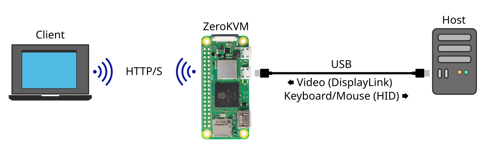

# ZeroKVM

A low-cost, easy-to-build KVM-over-IP device that acts as a DisplayLink monitor. No HDMI input or capture card, just a single USB port. No special software is required on the host, only the DisplayLink driver, which is already built-in or available on most operating systems. This device can be used to quickly access headless machines or when no video output is available for a capture card.



## Host support
|OS|Support|Notes|
|-|-|-|
|Windows 10+|✅ Plug-and-Play|Windows Update should install the DisplayLink driver automatically|
|Linux|✅ Mainline|Most distributions includes the mainline `udl` driver. The proprietary DisplayLink driver also works|
|macOS|App required|The DisplayLink Manager app has to be installed|
|Android|App required|The DisplayLink Presenter app has to be installed|

## Development status
Implement features works well. The web client still needs a bit of polishing and better error handling.

|Feature|Status|
|-|-|
|Video capture (DisplayLink)|✅|
|Keyboard input (HID Boot Keyboard)|✅|
|Send text as keystrokes|✅|
|Mouse input (HID Absolute Mouse)|✅|
|Mouse input (HID Relative Mouse)|✅|
|Mouse input (HID Digitizer)|Planned|
|Web client|✅|
|8 bits color depth|Planned|
|16 bits color depth|✅|
|24 bits color depth|Planned|
|HTTP Basic Authentication|Planned|
|RNDIS Ethernet gadget|Planned|
|CDC-ECM Ethernet gadget|Planned|
|CDC-NCM Ethernet gadget|Planned|
|File transfers through MTP gadget|Planned|
|Mass Storage gadget|Planned|

## Limitations
- The DisplayLink protocol implemented is USB 2.0 only. It is usable for desktop usage, but anything with large detailed or changing areas (like media content) will drop frames. Decoding the pixels is cpu intensive and can max out an SBC like the RPi Zero 2.
- Maximum 1920x1080 resolution
- Does not work for pre-boot management like BIOS or OS installation/repair where the DisplayLink driver cannot run

## Installation
- For Debian, Ubuntu, RPiOS or other distro based on SystemD, see [systemd](./systemd/readme.md)
- For OpenWRT, see [openwrt](./openwrt/readme.md)

## Hardware requirements
- Board with a USB device/OTG controller
- ARM64 CPU with AdvSIMD, little-endian
- 100 MB of RAM dedicated to the program

## Runtime dependencies
- libc
- libssl (if using HTTPS)

## Build with docker
For RPiOS (Debian) or other distro based on glibc
```shell
sh build-docker.sh linux-arm64
```

For OpenWRT, Alpine Linux or other distro based on musl-libc
```shell
sh build-docker.sh linux-musl-arm64
```

The compiled binary will be saved in `bin/linux-*/zerokvm`.

## Build with dotnet CLI

### Dependencies

- .NET 10 SDK
- [.NET AOT dependencies](https://learn.microsoft.com/en-us/dotnet/core/deploying/native-aot)
- clang
- xxd
- libaio (C headers with static binary)
- libturbojpeg (static binary)

```shell
# For RPiOS (Debian) or other distros based on glibc
dotnet publish -r linux-arm64 src/ZeroKvm -o bin/linux-arm64

# For OpenWRT, Alpine Linux or other distros based on musl-libc
dotnet publish -r linux-musl-arm64 src/ZeroKvm -o bin/linux-musl-arm64
```

## License

This program is free software: you can redistribute it and/or modify it under the terms of the [GNU General Public License](https://www.gnu.org/licenses/gpl-3.0.txt) as published by the Free Software Foundation, either version 3 of the License, or (at your option) any later version.

This program is distributed in the hope that it will be useful, but WITHOUT ANY WARRANTY; without even the implied warranty of MERCHANTABILITY or FITNESS FOR A PARTICULAR PURPOSE. See the GNU General Public License for more details.

This software is based in part on the work of the Independent JPEG Group.
